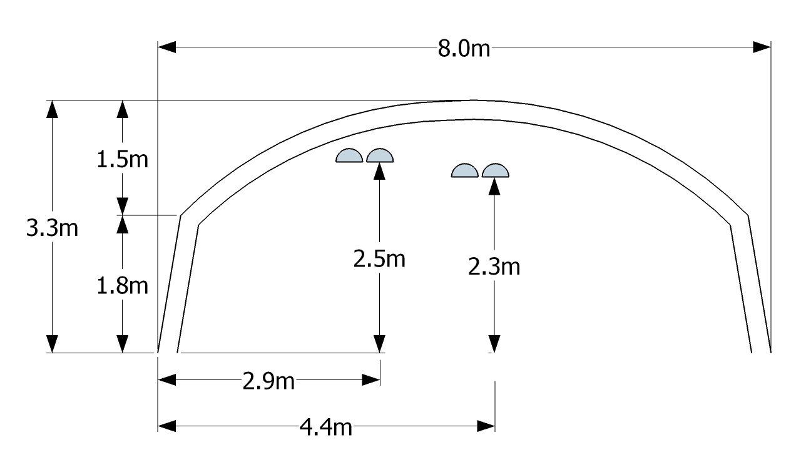
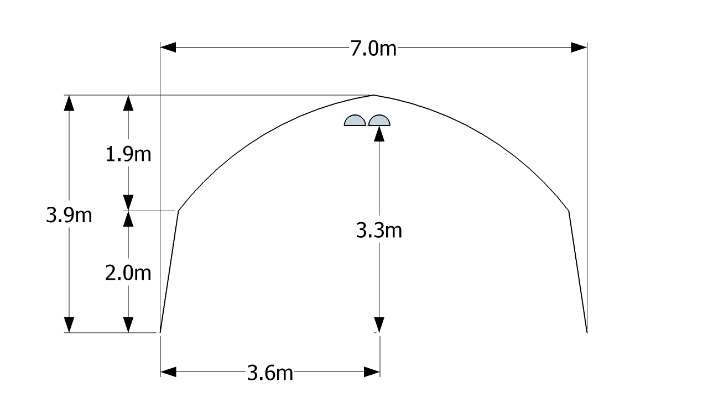

```{r setup, include=FALSE}
library(flexdashboard)
library(ggplot2)
library(lubridate)
library(dplyr)
library(readr)
library(gridExtra)
library(tidyr)

# Setup knitr
knitr::opts_chunk$set(echo = FALSE, message = FALSE, warning = FALSE)

df<- read_csv("D:/1. 연구과제 관련/3. 비닐하우스 구조 자재 설계 및 성능 평가(2017 ~ 2019)/2. SRD & PAR Data/watchdog/20170601 ~ STR & PAR_int_5min.csv") 

df1<- mutate(df,
       Date_time=as.POSIXct(Date_Time),
       year=year(Date_time),
       month=month(Date_time),
       day=day(Date_time),
       hour=hour(Date_time),
       minute=minute(Date_time),
       b01th=(B1_TH_SRD/OUT_SRD)*100,
       b02th=(B2_TH_SRD/OUT_SRD)*100,
       a07th=(A7_TH_SRD/OUT_SRD)*100,
       b01ch=(B1_CH_SRD/OUT_SRD)*100,
       b02ch=(B2_CH_SRD/OUT_SRD)*100,
       b02cl=(B2_CL_SRD/OUT_SRD)*100,
       a07ch=(A7_CH_SRD/OUT_SRD)*100,
       b031L=(B3_CH1L_SRD/OUT_SRD)*100,
       b091L=(B9_CH1L_SRD/OUT_SRD)*100,
       b101L=(B10_CH1L_SRD/OUT_SRD)*100,
       b092L=(B9_CH2L_SRD/OUT_SRD)*100,
       b102L=(B10_CH2L_SRD/OUT_SRD)*100)%>%
  
  filter("2018-01-01 07:30:00"<=Date_time & "2018-12-31 17:25:00">=Date_time )%>%
  select(Date_time, B1_TH_SRD, OUT_SRD, A7_TH_SRD, b01th:b102L, year, month, day)%>%
  mutate_if(is.numeric, list(~na_if(., Inf)))%>% 
  group_by(year, month)%>%
  summarise_at(2:14, funs(mean, sd), na.rm=T)

theme<-  theme(panel.grid = element_blank(),
        plot.title = element_text(size=9),
        plot.caption = element_text(size=7),
        axis.text = element_text(size = 9, colour = "black"),
        axis.title = element_text(size=9),
        legend.text = element_text(size=9),
        legend.title = element_blank(),
        legend.position = c(0.18, 0.9))
```

## Row 1 {data-height=17}

###
<table style="width:100%">
<tr>
   <td align="center" rowspan="2">
   </img>
  </td>
  <td>
  <center>
  <h3>**온실 유형별 광투과량 분석**</h3>
  </center>
  </td>
  
  <td rowspan="2">
   </img>
  </td>

</tr>
<tr><td><center>
 류희룡·최만권·조명환·유인호·김승유<br>시설원예연구소
  </center></td>
</tr>
</table> 


<hr>

**연구의 목적**

* 온실 내부로 투과되는 태양광은 식물의 광합성 및 내부 기상 환경에 영향을 미치는 주요한 인자 임
* 온실 내부에 투과되는 광량은 온실구조와 자재, 설치방향 및 피복재의 종류에 따라 영향을 받음
* 온실설계를 할 때 주로 안전성 위주로 설계가 이루어짐
* 현장에서는 온실의 설계의 안전성뿐만 아니라 온실의 방향, 골조율, 피복재의 종류에 따른 광 투과 특성을 고려한 설계를 요구함  
* 따라서 본 연구결과는 온실의 형태 및 피복재의 종류에 따른 광투과율을 비교분석 함  
* 광 투과 특성을 고려한 온실 설계의 기초 자료로의 활용 가능성과 분석방법의 타당성을 알아 보았음


## Row 3 {data-height=74}
### **재료 및 방법**
* 분석기간: 2018-1-1 ~ 2018-12-31
* 측정장소: 함안군 시설원예연구소  
    (35°14’05.7”N 128°25’34.2”E)
* 측정항목:
    + 일사량(300 ~ 1100 nanometers),
    + 광도(400 ~ 700 nanometers)
* 측정센서:
    + 일사량(Lightscout, Spectrum Tech., Inc., 0 ~ 2500 μ㏖/m^2^/s) 
    + 광도(WatchDog, Spectrum Tech., Inc., 0 ~ 1500 W/m^2^)
* 측정간격: 5분
* 온실형태: 총 5동
    + 연동 2동(A7, B1, B2)
    + 단동 3동(B3, B9, B10)
* 온실방향: 정남북
* 분석항목: 광투과율
* 분석프로그램: RStudio

$$광투과율=내부광/외부광 * 100$$

**Fig. 1 측정 온실 치수**

<html>

<style>
#size{
width: 100%;
height: 80px;
}

#size1{
width: 50%;
height: 80px;
}

</style>

<body>

<table align='left'>
  <td><center><figcaption>B1</figcaption></img></center></td>
  <td><center><figcaption>B2</figcaption></img></center></td>
</table>


<table align='left'>
  <td><center><figcaption>B9</figcaption></center></img></td>
  <td><center><figcaption>B10</figcaption></center></img></td>
</table>


<table align='left'>
  <td><center><figcaption>B3</figcaption></center></img></td>
</table>

</body>
</html>


**Table 1. 온실 지붕 경사각 및 피복재**

|온실|A7|B1|B2|B9|B10|B3|
|---:|:-:|:-:|:-:|:-:|:-:|:-:|
|경사각(˚)|22.5|26.6|29.7|25.2|25.2|30.7|
|피복재|유리|PO|PO|PO|직조|PE|
|두께(mm)|4|0.1|0.1|0.1|0.2|0.1|


### **결과**

**Fig. 2. 온실 형태별 월별 광투과율 (일출 ~ 일몰)**

####  


```{r echo=FALSE, out.width = "100%", fig.height=2.2, fig.align='center'}

A7<- ggplot(df1, aes(month, a07th_mean, fill=factor(year)))+geom_bar(stat="identity", position = "dodge", width=0.8, show.legend = F)+
  geom_errorbar(aes(ymin=a07th_mean-a07th_sd, ymax=a07th_mean+a07th_sd), position = "dodge", width=0.5, col="darkgray")+
  scale_x_continuous(breaks=c(1:12))+
  xlab("Month")+ylab("Light Transmittance (%)")+
  theme_bw()+
  annotate("text", x=2, y=130, size=3, label= "A01 (연동, 유리, 26.6˚)")+
 ylim(0,150)+
  scale_fill_brewer(palette ="Dark2")+
  theme
A7
```


####  


```{r echo=FALSE, out.width = "100%", fig.height=2.2, fig.align='center'}

B1<- ggplot(df1, aes(month, b01th_mean, fill=factor(year)))+geom_bar(stat="identity", position = "dodge", width=0.8, show.legend = F)+
  geom_errorbar(aes(ymin=b01th_mean-b01th_sd, ymax=b01th_mean+b01th_sd), position = "dodge", width=0.5, col="darkgray")+
  scale_x_continuous(breaks=c(1:12))+
  xlab("Month")+ylab("Light Transmittance (%)")+
  theme_bw()+
  annotate("text", x=2, y=130, size=3, label= "B01 (연동, PO필름, 26.6˚)")+
 ylim(0,150)+
  scale_fill_brewer(palette ="Dark2")+
  theme
B1
```


####


```{r echo=FALSE, out.width = "100%", fig.height=2.2, fig.align='center'}

B2<- ggplot(df1, aes(month, b02th_mean, fill=factor(year)))+geom_bar(stat="identity", position = "dodge", width=0.8, show.legend = F)+
  geom_errorbar(aes(ymin=b02th_mean-b02th_sd, ymax=b02th_mean+b02th_sd), position = "dodge", width=0.5, col="darkgray")+
  scale_x_continuous(breaks=c(1:12))+
  xlab("Month")+ylab("Light Transmittance (%)")+
  theme_bw()+
  theme_bw()+
 annotate("text", x=2, y=130, size=3, label= "B02 (연동, PO필름, 29.7˚)")+
 ylim(0,150)+
  scale_fill_brewer(palette ="Dark2")+
  theme

B2
```


####


```{r echo=FALSE, out.width = "100%", fig.height=2.2, fig.align='center'}

B9<- ggplot(df1, aes(month, b091L_mean, fill=factor(year)))+geom_bar(stat="identity", position = "dodge", width=0.8, show.legend = F)+
  geom_errorbar(aes(ymin=b091L_mean-b091L_sd, ymax=b091L_mean+b091L_sd), position = "dodge", width=0.5, col="darkgray")+
  scale_x_continuous(breaks=c(1:12))+
  xlab("Month")+ylab("Light Transmittance (%)")+
  theme_bw()+
 annotate("text", x=2, y=130, size=3, label= "B09 (단동, PO필름, 25.2˚)")+
 ylim(0,150)+
  scale_fill_brewer(palette ="Dark2")+
  theme
B9
```


####


```{r echo=FALSE, out.width = "100%", fig.height=2.2, fig.align='center'}

B10<- ggplot(df1, aes(month, b101L_mean, fill=factor(year)))+geom_bar(stat="identity", position = "dodge", width=0.8, show.legend = F)+
  geom_errorbar(aes(ymin=b101L_mean-b101L_sd, ymax=b101L_mean+b101L_sd), position = "dodge", width=0.5, col="darkgray")+
  scale_x_continuous(breaks=c(1:12))+
  xlab("Month")+ylab("Light Transmittance (%)")+
  theme_bw()+
 annotate("text", x=2, y=130, size=3, label= "B10 (단동, 직조필름, 25.2˚)")+
 ylim(0,150)+
  scale_fill_brewer(palette ="Dark2")+
  theme

B10
```

####

```{r echo=FALSE, out.width = "100%", fig.height=2.2, fig.align='center'}

B03<- ggplot(df1, aes(month, b031L_mean, fill=factor(year)))+geom_bar(stat="identity", position = "dodge", width=0.8, show.legend = F)+
  geom_errorbar(aes(ymin=b031L_mean-b031L_sd, ymax=b031L_mean+b031L_sd), position = "dodge", width=0.5, col="darkgray")+
  scale_x_continuous(breaks=c(1:12))+
  xlab("Month")+ylab("Light Transmittance (%)")+
  theme_bw()+
  annotate("text", x=2, y=130, size=3, label= "B03 (단동, PE필름, 30.7˚)")+
   ylim(0,150)+
  scale_fill_brewer(palette ="Dark2")+
  theme


B03
```

**Table 2. 온실 형태별 동절기 광투과율 (일출 ~ 일몰)**

|온실|A7|B1|B2|B9|B10|B3|
|---:|:-:|:-:|:-:|:-:|:-:|:-:|
|12월(%)|40.8|68.5|67.6|63.9|40.7|69.5|
|01월(%)|43.0|70.9|67.3|72.2|55.7|72.5|
|02월(%)|41.8|75.2|74.4|75.6|58.4|73.5|


### **결과**

**Fig. 3. 온실 형태별 광투과율 (일출 ~ 오전 12시)**

####  

```{r echo=FALSE, out.width = "100%", fig.height=2.2, fig.align='center'}

df12<- mutate(df,
       Date_time=as.POSIXct(Date_Time),
       year=year(Date_time),
       month=month(Date_time),
       day=day(Date_time),
       hour=hour(Date_time),
       minute=minute(Date_time),
       b01th=(B1_TH_SRD/OUT_SRD)*100,
       b02th=(B2_TH_SRD/OUT_SRD)*100,
       a07th=(A7_TH_SRD/OUT_SRD)*100,
       b01ch=(B1_CH_SRD/OUT_SRD)*100,
       b02ch=(B2_CH_SRD/OUT_SRD)*100,
       b02cl=(B2_CL_SRD/OUT_SRD)*100,
       a07ch=(A7_CH_SRD/OUT_SRD)*100,
       b031L=(B3_CH1L_SRD/OUT_SRD)*100,
       b091L=(B9_CH1L_SRD/OUT_SRD)*100,
       b101L=(B10_CH1L_SRD/OUT_SRD)*100,
       b092L=(B9_CH2L_SRD/OUT_SRD)*100,
       b102L=(B10_CH2L_SRD/OUT_SRD)*100)%>%
  
  filter("2018-01-01 07:30:00"<=Date_time & "2018-12-31 17:25:00">=Date_time )%>%
  filter(hour==6|hour==7|hour==8|hour==9|hour==10|hour==11|hour==12)%>%
  select(Date_time, b01th:b102L, year, month, day)%>%
  mutate_if(is.numeric, list(~na_if(., Inf)))%>% 
  group_by(year, month)%>%
  summarise_at(2:14, funs(mean, sd), na.rm=T)
  
  a7<- ggplot(df12, aes(month, a07th_mean, fill=factor(year)))+geom_bar(stat="identity", position = "dodge", width=0.8,show.legend = F)+
  geom_errorbar(aes(ymin=a07th_mean-a07th_sd, ymax=a07th_mean+a07th_sd), position = "dodge", width=0.5, col="darkgray")+
  scale_x_continuous(breaks=c(1:12))+
  xlab("Month")+ylab("Light Transmittance (%)")+
  theme_bw()+
  annotate("text", x=1, y=120, size=3, label= "A07")+
  ylim(0,150)+
  theme
  a7

```


####  
```{r echo=FALSE, out.width = "100%", fig.height=2.2, fig.align='center'}
  b1<- ggplot(df12, aes(month, b01th_mean, fill=factor(year)))+geom_bar(stat="identity", position = "dodge", width=0.8,show.legend = F)+
  geom_errorbar(aes(ymin=b01th_mean-b01th_sd, ymax=b01th_mean+b01th_sd), position = "dodge", width=0.5, col="darkgray")+
  scale_x_continuous(breaks=c(1:12))+
  xlab("Month")+ylab("Light Transmittance (%)")+
  theme_bw()+
  annotate("text", x=1, y=120, size=3, label= "B01")+
  ylim(0,150)+
  theme
  b1
```


####  

```{r echo=FALSE, out.width = "100%", fig.height=2.2, fig.align='center'}
  b2<- ggplot(df12, aes(month, b02th_mean, fill=factor(year)))+geom_bar(stat="identity", position = "dodge", width=0.8,show.legend = F)+
  geom_errorbar(aes(ymin=b02th_mean-b02th_sd, ymax=b02th_mean+b02th_sd), position = "dodge", width=0.5, col="darkgray")+
  scale_x_continuous(breaks=c(1:12))+
  xlab("Month")+ylab("Light Transmittance (%)")+
  theme_bw()+
  annotate("text", x=1, y=120, size=3, label= "B02")+
    ylim(0,150)+
  theme
  b2
```


####  

```{r echo=FALSE, out.width = "100%", fig.height=2.2, fig.align='center'}
  b9<- ggplot(df12, aes(month, b091L_mean, fill=factor(year)))+geom_bar(stat="identity", position = "dodge", width=0.8,show.legend = F)+
  geom_errorbar(aes(ymin=b091L_mean-b091L_sd, ymax=b091L_mean+b091L_sd), position = "dodge", width=0.5, col="darkgray")+
  scale_x_continuous(breaks=c(1:12))+
  xlab("Month")+ylab("Light Transmittance (%)")+
  theme_bw()+
  annotate("text", x=1, y=120, size=3, label= "B09")+
   ylim(0,150)+
  theme
  b9
```


####  


```{r echo=FALSE, out.width = "100%", fig.height=2.2, fig.align='center'}
  b10<- ggplot(df12, aes(month, b101L_mean, fill=factor(year)))+geom_bar(stat="identity", position = "dodge", width=0.8,show.legend = F)+
  geom_errorbar(aes(ymin=b101L_mean-b101L_sd, ymax=b101L_mean+b101L_sd), position = "dodge", width=0.5, col="darkgray")+
  scale_x_continuous(breaks=c(1:12))+
  xlab("Month")+ylab("Light Transmittance (%)")+
  theme_bw()+
  annotate("text", x=1, y=120, size=3, label= "B10")+
    ylim(0,150)+
  theme
  b10
```


####  


```{r echo=FALSE, out.width = "100%", fig.height=2.2, fig.align='center'}
  b3<- ggplot(df12, aes(month, b031L_mean, fill=factor(year)))+geom_bar(stat="identity", position = "dodge", width=0.8,show.legend = F)+
  geom_errorbar(aes(ymin=b031L_mean-b031L_sd, ymax=b031L_mean+b031L_sd), position = "dodge", width=0.5, col="darkgray")+
  scale_x_continuous(breaks=c(1:12))+
  xlab("Month")+ylab("Light Transmittance (%)")+
  theme_bw()+
  annotate("text", x=1, y=120, size=3, label= "B03")+
   ylim(0,150)+
  theme
  b3
```

**Table 3. 온실 형태별 동절기 광투과율 (일출 ~ 오전 12시)**

|온실|A7|B1|B2|B9|B10|B3|
|---:|:-:|:-:|:-:|:-:|:-:|:-:|
|12월(%)|44.4|68.6|68.8|68.5|46.5|68.9|
|01월(%)|44.5|71.9|69.0|79.9|60.1|76.7|
|02월(%)|44.5|75.5|78.3|81.0|62.4|75.7|


## Row 4 {data-height=20}

### **결과** {data-width=50}

**Fig. 4. 연동온실 구조형태에 따른 광투과율 비교**

```{r echo=FALSE, out.width = "50%", fig.height=4.6, fig.show="hold"}

df_daily<- mutate(df,
                  Date_time=as.POSIXct(Date_Time),
                  year=year(Date_time),
                  month=month(Date_time),
                  day=day(Date_time),
                  hour=hour(Date_time),
                  minute=minute(Date_time))

df_B1<-  df_daily%>% select(Date_time, B1_TH_SRD, B1_CH_SRD, B1_TH_PAR, OUT_SRD, OUT_PAR, day, hour)%>% filter("2018-01-01 07:30:00"<=Date_time & "2018-01-01 17:35:00">=Date_time)
df_B2<-  df_daily%>% select(Date_time, B2_TH_SRD, B2_CH_SRD, B2_TH_PAR, OUT_SRD, OUT_PAR, day, hour)%>% filter("2018-01-01 07:30:00"<=Date_time & "2018-01-01 17:35:00">=Date_time)


G1<- df_B1 %>%
  select(Date_time, B1_TH_SRD, OUT_SRD, day, hour)%>% 
  gather(type, value, -Date_time, -day, -hour)%>%
  ggplot(aes(x=hour, y=value, col=type))+geom_point(size=2)+
  #stat_summary(fun.y = mean, geom = "point", size=3, aes(shape=type))+
  #stat_summary(fun.y = mean, geom = "text", size=4, show.legend=F,  hjust = 1.3, vjust = 0.5, aes(label=sprintf("%1.1f",..y..)))+
  stat_summary(fun.y = mean, geom = "line", size=1, show.legend=F, aes(col=type))+
  #stat_summary(fun.data ="mean_se", geom = "errorbar", width=0.5)+
  scale_color_brewer(palette ="Dark2",labels=c("내부", "외부"))+
  scale_shape_discrete(labels=c("피복교체 전 (2017-10-10)", "피복교체 후 (2018-10-10)"))+
  annotate("text", x=9, y=750, size=5, label= "일평균 광투과율: 68.4%")+
  #annotate("text", x=8, y=750, size=3, label= "일평균 투과율: 68.1% (후)")+
  theme_bw()+
  scale_x_continuous(breaks = seq(6, 17, 1))+
  labs(x="hour",
       y=expression(paste("Solar Radiation" (W/m^{2}))))+
  ylim(0,950)+
  labs(title = "B1 (연동, PO, 26.6˚)",
       caption="")+
  theme(panel.grid = element_blank(),
        plot.title = element_text(size=15),
        plot.caption = element_text(size=12),
        axis.text = element_text(size = 12, colour = "black"),
        axis.title = element_text(size=12),
        legend.text = element_text(size=12),
        legend.title = element_blank(),
        legend.position = c(0.1, 0.9))
G1

G2<- df_B2 %>%
  select(Date_time, B2_TH_SRD, OUT_SRD, day, hour)%>% 
  gather(type, value, -Date_time, -day, -hour)%>%
  ggplot(aes(x=hour, y=value, col=type))+geom_point(size=2)+
  #stat_summary(fun.y = mean, geom = "point", size=3, aes(shape=type))+
  #stat_summary(fun.y = mean, geom = "text", size=4, show.legend=F,  hjust = 1.3, vjust = 0.5, aes(label=sprintf("%1.1f",..y..)))+
  stat_summary(fun.y = mean, geom = "line", size=1, show.legend=F, aes(col=type))+
  #stat_summary(fun.data ="mean_se", geom = "errorbar", width=0.5)+
  scale_color_brewer(palette ="Dark2",labels=c("내부", "외부"))+
  scale_shape_discrete(labels=c("피복교체 전 (2017-10-10)", "피복교체 후 (2018-10-10)"))+
  annotate("text", x=9, y=750, size=5, label= "일평균 광투과율: 70.1%")+
  #annotate("text", x=8, y=750, size=3, label= "일평균 투과율: 68.1% (후)")+
  theme_bw()+
  scale_x_continuous(breaks = seq(6, 17, 1))+
  labs(x="hour",
       y=expression(paste("Solar Radiation" (W/m^{2}))))+
  ylim(0,950)+
  labs(title = "B2 (연동, PO, 29.7˚)",
       caption="2018-01-01 맑은날 일사량")+
  theme(panel.grid = element_blank(),
        plot.title = element_text(size=15),
        plot.caption = element_text(size=12),
        axis.text = element_text(size = 12, colour = "black"),
        axis.title = element_text(size=12),
        legend.text = element_text(size=12),
        legend.title = element_blank(),
        legend.position = c(0.1, 0.9))
G2


```


### **결론**{data-width=45}
<br>
<html>
<head>
<style>
div.a {
line-height: 160%;
text-aling: justify;
}
</style>
</head>
<body>

<div class="a"  >
* 본 연구는 온실의 형태와 피복재의 종류에 따른 광투과량을 비교 분석하였음
* 광투과율은 1중 피복(PO)인 연동보다 1중 피복(PO)의 단동이 높게 나타남
* 피복재별로는 PO필름(B1, B2, B9)이 직조필름(B10) 보다 높았음
* 단동온실의 1중과 2중 피복 내부의 광투과율을 비교해 보면,  B9의 2중 피복(PO) 내부의 광투과율은 1중(PO)보다 약 18 ~ 25% 포인트  감소하였고 B10의 2중(PE필름)은 약 50% 포인트 이상 감소하였음
* B1과 B2 온실의 광투과율을 비교한 결과 온실 구조에 따른 차이는 2% 내외로 분석됨
* 기본 측정간격 자료에 의한 누적광량 비교, 작물재배 구간별 시뮬레이션 등 분석결과의 신뢰성을 높이기 위한 후속연구가 필요함
</p>
</body>

</html>

